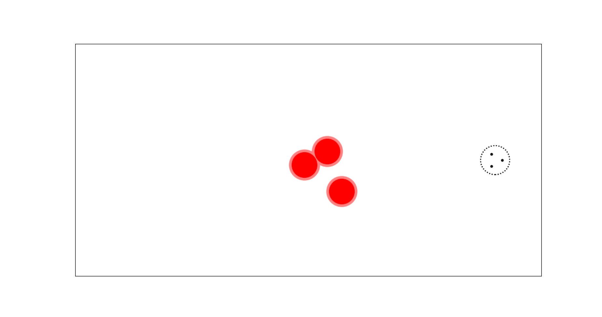

# MARL-nav
This project contains a GPU-parallelized multi-agent environment and a MAPPO algorithm
for solving it. Both of these are implemented with PyTorch. The environment has a target
area which the agents attempt to reach in a loose formation, while avoiding obstacles on
their way. The GPU-parallelization makes it possible to run over thousand instances of
the environment in parallel during the rollouts, which significantly speeds up the training.

The first image below shows the initial state of a single environment. The second image
depicts its ideal end state where the agents have reached the target area together.
The red disks in the middle are the obstacles whose positions are randomly sampled in
the environments initialization. The agents positions are represented with three black
dots and the target area on the left with a dotted lined circle. (For better resolution,
click the images.)

<p align="middle">
  
  
</p>

The task may seem easy but it is actually made up from a few competing sub-tasks, which makes it
non-trivial. Namely, the target area is meant to be reached together as a group, the obstacles
need to be avoided before this, and the agents should stay relatively close to each other but
not collide.

This difficulty also shows up during the training. In particular, for some random seeds
the agents seem to get stuck in a vibrating movement pattern. Moreover, I haven't yet
been able to make the agents to learn to solve the task. This is mainly because I haven't
yet had the time to do a proper hyperparameter search and reward engineering. I'll
mention possible solutions to this training instability at the end of this readme.

## Installation
Clone this repository and install the libraries with pip:
```
git clone https://github.com/JussiM01/MARL-nav
cd Marl-nav/
pip install -r requirements.txt
```

## How to use
The command for the model training with default hyperparameter values is
```
python -m marlnav
```
This will also save the actor and critic models' weight files as well as the statistics,
logs and plots from the training to separate directories. A random seed can be added
as follows
```
python -m marlnav -se <Seed's integer value>
```

The default hyperparameter values can be changed. For full list of all the flags, use
the help flag:
```
python -m marlnav -h
```

The saved actor model's policy can be renderer with the command
```
python -m marlnav -re -sa policy -w <Actor model's filename>
```
This will use the predicted mean of the stochastic policy.

For random sampling the action values from the saved policy, add a ```-ra``` flag
to the above command. However, notice that sampling the actions from the policy
(instead of using its predicted mean) will make the agents' movements very wiggly
and will not produce optimal behavior.

At the moment there exists also so called reward check functionality for helping
to experiment with different reward combinations and checking out if the environment
behaves as it should. I might remove it when the experimentations are ready. It is
used for running the environment with predetermined actions trajectories, and saving
all the rewards and observations from these runs to plots. For example, the command
```
python -m marlnav -rc -sn -1 -se 0
```
runs the environment with the sampler option ```-sn -1```, where the agents move on a constant
speed horizontal trajectories. I used this for testing the effects of collisions and target
reaches. The other options (values 0 and 1) have even more rigid settings (the objects' positions
are also predetermined) and the random seed dose not affect them. It is also possible to visualize
all of these by rendering, for example
```
python -m marlnav -re -sn -1 -se 0
```
renders the environment's visualization of the previous command. Or to be more precise, there
are actually two parallel environments, and this shows the movements from the index 0 (which
is the default value). For visualization of the parallel index value 1, use the following command
```
python -m marlnav -re -sn -1 -se 0 -pi 1
```

## About the implementation
The MAPPO algorithm is described in the original [article](https://arxiv.org/pdf/2103.01955).
As a main code reference for the PPO implementation I used a single agent PPO tutorial which
can be found from this [repository](https://github.com/BrianPulfer/PapersReimplementations).
It has a discrete action space, so for the continuous action space reference I used this
[code](https://github.com/seungeunrho/minimalRL/blob/master/ppo-continuous.py).

The main challenge in this implementation was that many things had to be vectorized twice,
both in the multi-agent and in the parallel environment dimension. For example, the states
tensor satisfies the following

<p align="center">
  <i>
  states shape = (number of parallel environments, number of agents, single agent's state size).
  </i>
<p>

Furthermore, due to parallelization the environments have to be initialized on the fly
for those indices where a terminal condition is met (the target is reached, there is a
collision or a time cut-off).

The reward contains several components which are summed up. The main one is for reaching
the target area together. The other ones are helpers for this and I'm still doing the
reward engineering on them.

## Future updates
Regarding the training instability, I have thought about adding agents velocities to
the models input tenors, along with a velocity related component to the reward (which
would encourage alignment of the velocities). Other thing I might add is a phased
training scheme. In it the obstacles would first be in the sides allowing a straight
corridor to the target and only in the later phases start to block the straight access.

In this implementation the observations (input tensors) have information on all of the
objects (other agents, obstacles, and target) center positions as an angle and a distance.
This is not so realistic setting. In future projects I plan to use more lidar/radar
type of inputs where the objects can block each others visibility. Another idea for
a future project is to have a second group of agents which tries to stop the first
from reaching the target area (as in the reach-avoid games).
